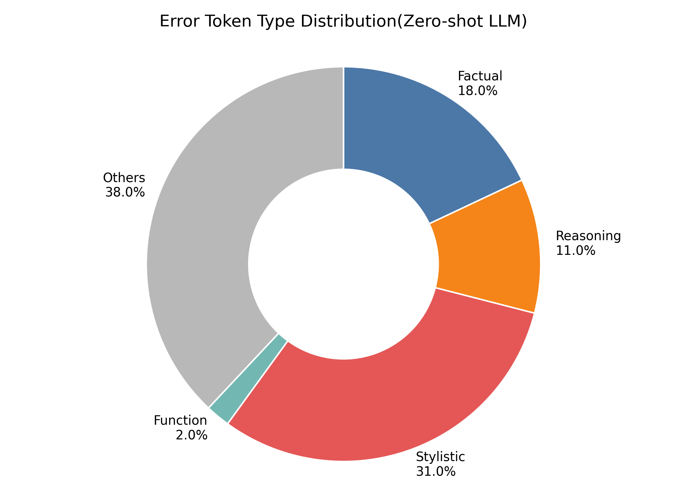
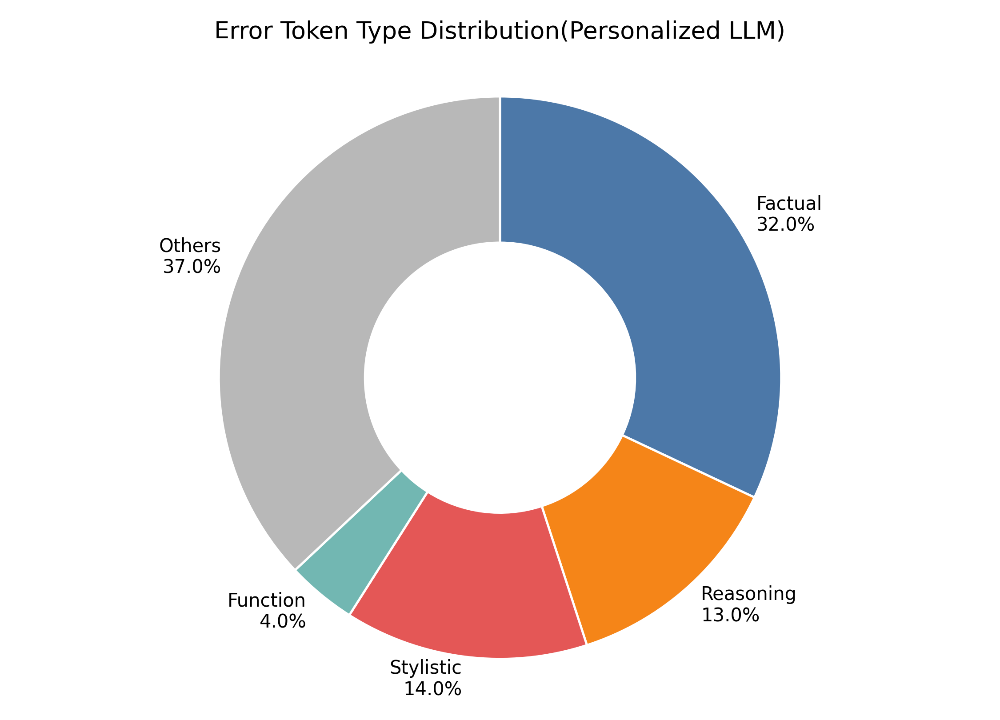
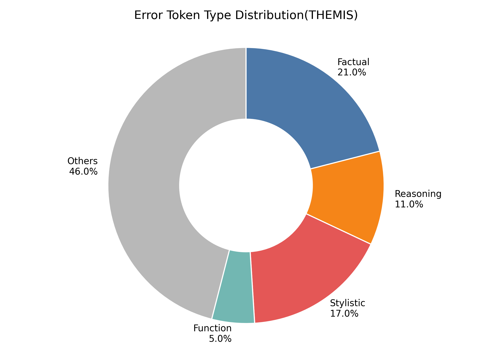

# Questions: analysis of routing behavior and failure modes

> **Q1**: What fraction of tokens are routed through each stage (I, II, III) across different datasets?

We report the routing distribution across stages in Table X. The results show that THEMIS does not degenerate into trivial routing: while Stage I (distributional convergence) handles the majority of tokens, a non-trivial fraction (12–16%) is consistently routed to the general model via Stage II, indicating the presence of strongly constrained tokens across datasets.

Stage III accounts for a smaller but consistent portion of tokens, reflecting cases where neither simple agreement nor strong constraints apply. These observations support our hypothesis of token-level heterogeneity, where different tokens require different routing decisions.

|               | Stage I → u | Stage II → g | Stage III → u | Stage III → p* |
| ------------- | ----------- | ------------ | ------------- | -------------- |
| Amazon-Review | 71.4%       | 12.7%        | 8.6%          | 7.3%           |
| LaMP-5        | 79.3%       | 13.4%        | 5.2%          | 2.1%           |
| PerGenBench   | 77.7%       | 16.4%        | 2.5%          | 3.4%           |

> **Q2**: In what cases does the constrained distribution p* (Eq. 8) fail to prevent factual errors?

We find that failures of the constrained distribution p* mainly arise when the feasible support set derived from the general model already contains incorrect candidates. In such cases, p* cannot fully prevent factual errors, as it relies on the general model to define the feasible region.

Additionally, when semantic alignment is overestimated (Stage III), the personalized model may introduce subtle semantic drift that is not fully filtered by Top-p truncation.

> **Q3**: Are there systematic patterns in routing errors (e.g., certain token types that are frequently misrouted)?

We categorize tokens into five types based on their functional roles: 
(1) factual tokens (e.g., entities such as “Paris” or numbers like “1998”), 
(2) reasoning tokens (e.g., “because”, “therefore”), 
(3) stylistic tokens (e.g., “amazing”, “honestly”), 
(4) function tokens (e.g., “the”, “is”), 
(5) others

We conduct a manual analysis on randomly sampled failure cases and compare the distribution of error types across zero-shot generation, personalized fine-tuning, and THEMIS (see figures). We identify error-triggering tokens using a consistent proxy. Specifically, we first detect outputs that are factually incorrect under the same evaluation metric used in our main experiments. We then localize the token span responsible for the deviation (e.g., incorrect entities, numbers, or relations) by comparing with reference answers, assisted by an LLM (GPT-5.2) for consistency.

We observe clear systematic patterns. The personalized model exhibits a significantly higher proportion of errors on factual tokens, indicating that uniform personalization can degrade factual correctness. In contrast, the zero-shot model shows a higher proportion of stylistic errors, reflecting its limited ability to adapt to user preferences.

THEMIS achieves a more balanced error distribution, reducing both factual and stylistic errors compared to the baselines. This suggests that token-level routing effectively mitigates the trade-off between personalization and generalization.

These findings support our hypothesis that personalization should be treated as a token-level heterogeneous decision problem.

